# FitTrack — Android Fitness App

Native Android app (Kotlin + Jetpack Compose) for browsing exercises, building
workout plans, logging workouts, and tracking progress. Seeded from a
1,324-exercise dataset (multilingual instructions, ExerciseDB v1-derived).
Offline-first — everything except the exercise animations works with no network
at all.

**Kotlin · Jetpack Compose (Material 3) · MVVM · Hilt · Room · Coroutines/Flow ·
Navigation Compose · Coil (+GIF) · kotlinx.serialization · Vico · JUnit + Turbine**

---

## Screenshots

> Captured on an Android 15 emulator (Pixel 6, dark theme). The workout history
> shown is demo data generated for the screenshots.

### Home & workout plans

| Home | Workout plans | Plan editor |
|---|---|---|
| 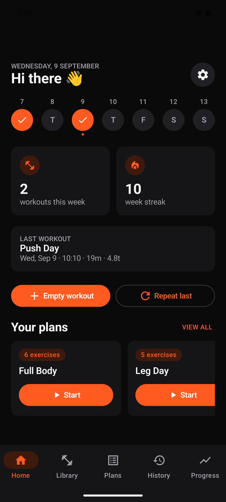 | 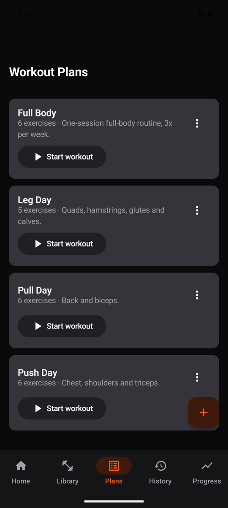 | 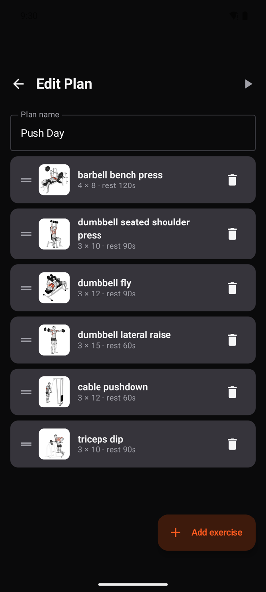 |

**Home** — the week strip marks the days you trained, followed by workouts this
week, current streak and a summary of the last session (plan, duration, total
volume). Quick-start buttons launch an empty workout, repeat the last one, or
start any plan directly.

**Workout plans** — every plan with its exercise count and description; each
card starts the workout in one tap. Four starter plans (Push / Pull / Legs /
Full Body) are seeded on first launch; the ⋮ menu renames, duplicates or
deletes them.

**Plan editor** — rename the plan, drag exercises into any order with the grip
handle, delete them, or add new ones from the library. Each slot stores its own
target sets × reps and rest time.

### Exercise library

| Library (search) | Exercise detail |
|---|---|
| 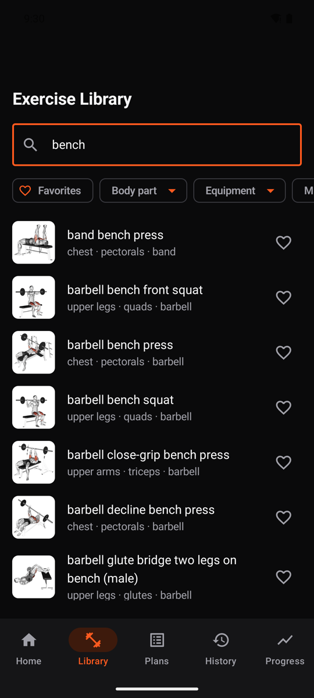 | 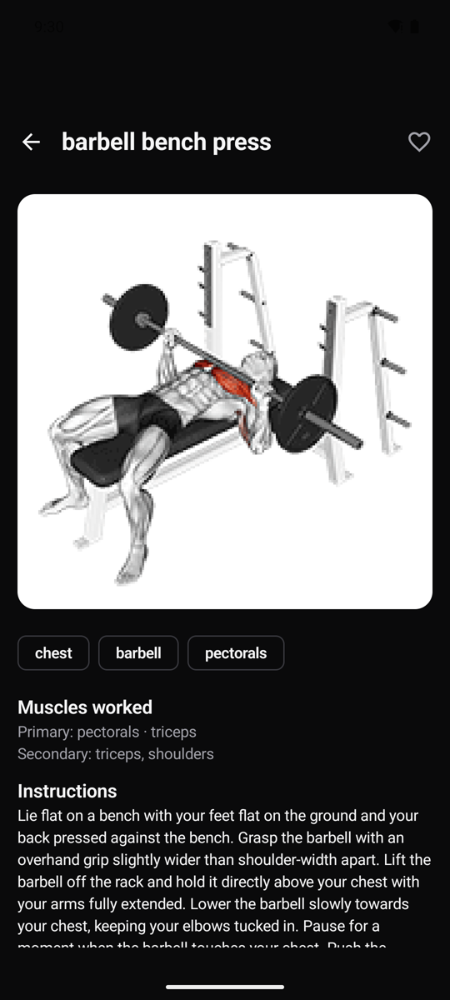 |

**Library** — instant search across 1,324 exercises plus filters by body part,
equipment, target muscle and favorites. Each row shows the animation thumbnail
and the body part · muscle · equipment triple.

**Exercise detail** — the animated GIF demo, tags, primary/secondary muscles and
step-by-step instructions in the device language (en / es / it / tr / ru / zh,
English fallback). The heart button toggles a favorite.

### Logging a workout

| Active workout | Workout summary | History |
|---|---|---|
| 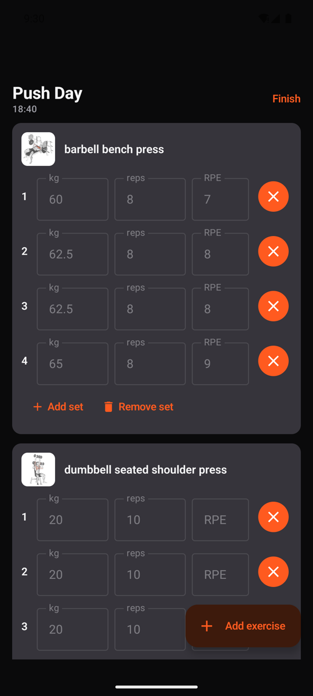 | 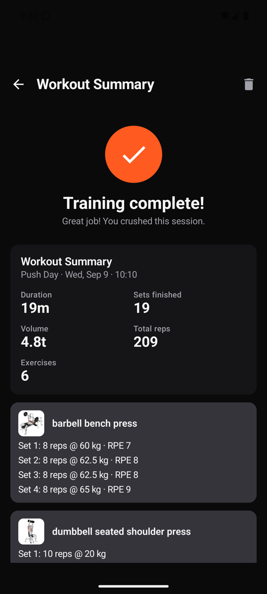 | 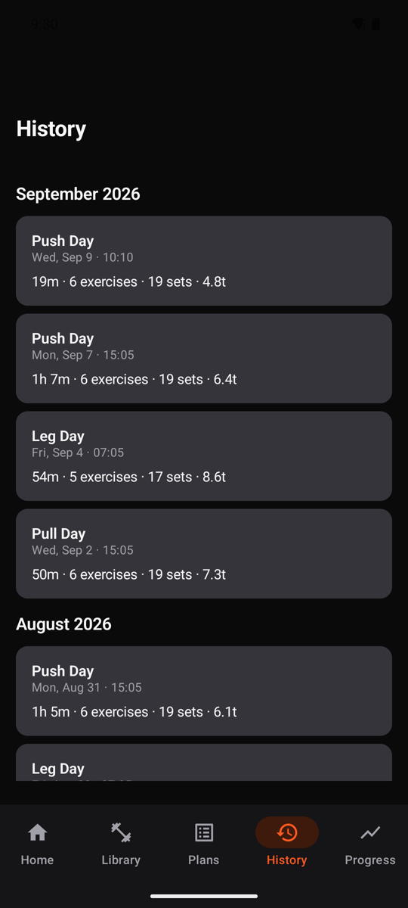 |

**Active workout** — an elapsed-time timer at the top, then one card per
exercise with a row per set: weight, reps and optional RPE, auto-filled from
your last session with that exercise. The circular button logs the set (and
starts the rest timer); sets can be added or removed on the fly. Every set is
written to the database as it is logged, so nothing is lost if the app is
killed mid-workout.

**Workout summary** — duration, sets finished, total volume, total reps and
exercise count, then a per-exercise breakdown of every set that was logged.

**History** — all completed workouts grouped by month, each with date, duration,
exercise/set count and volume. Tapping one reopens its full summary.

### Progress

| Exercise trend | Body weight | Settings |
|---|---|---|
| 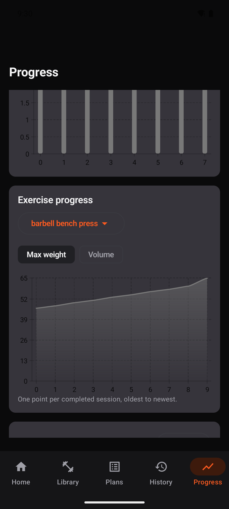 | 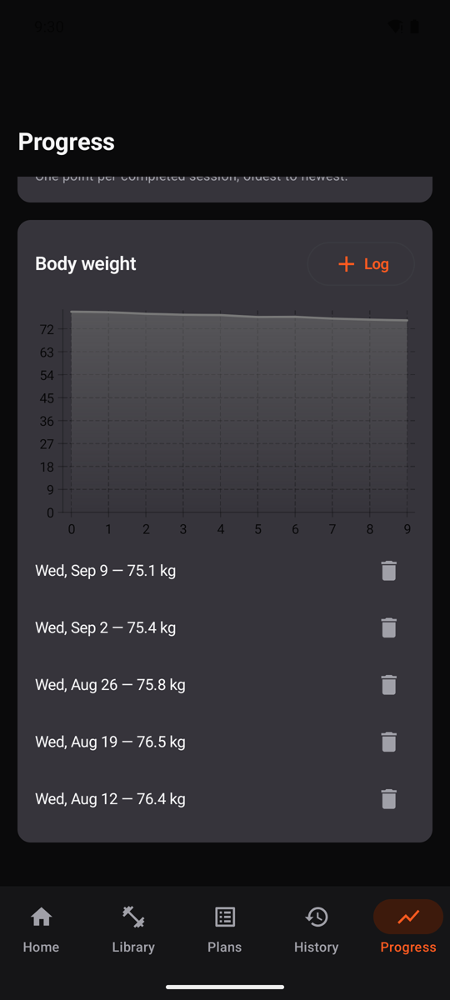 | 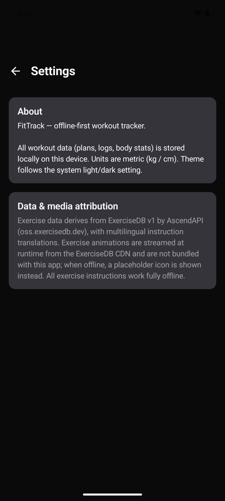 |

**Exercise trend** — pick any exercise you have logged and chart max weight or
total volume, one point per session, oldest to newest. Above it, a weekly
consistency bar chart and the current streak.

**Body weight** — log body weight (plus chest/waist/hips measurements) and see
the trend over time, with the full history listed underneath.

**Settings** — offline/storage summary and the data & media attribution for the
exercise dataset and animations.

---

## Features

- **Exercise Library** — search and filter 1,324 exercises by body part,
  equipment, and target muscle; favorite exercises; detail screen with
  animated GIF demo, muscles worked, and instructions in the device locale
  (en/es/it/tr/ru/zh, English fallback).
- **Workout Plans** — create/edit/delete plans, drag-and-drop reorder,
  per-exercise target sets/reps/weight/rest. Four starter plans seeded on
  first launch (Push / Pull / Legs / Full Body).
- **Workout Logging** — start from a plan, ad hoc, or repeat your last
  workout; log reps/weight/RPE per set with auto-fill from the last session;
  per-exercise rest timer; sets persist as you go, so nothing is lost if the
  app dies mid-workout.
- **History** — completed workouts grouped by month, with a per-workout
  summary (duration, volume, per-exercise set breakdown).
- **Progress** — per-exercise trend chart (max weight / volume, Vico), body
  weight + measurements log with trend chart, weekly consistency chart and
  streak.
- **Home** — weekly stats, streak, last-workout summary, quick-start buttons
  (empty workout, repeat last, start any plan).

## Media strategy (exercise GIFs)

The dataset ships **no media** — only a `media_id` per exercise. GIFs are
streamed lazily at runtime from the official ExerciseDB CDN
(`static.exercisedb.dev/media/{media_id}.gif`) via Coil (memory + disk cache,
animated GIF decoder). Nothing is bundled into the APK. If the device is
offline, the `mediaId` is missing, or the CDN errors/rate-limits, every image
slot falls back to a body-part placeholder icon — all exercise data and
instructions remain fully usable offline. This is a free, unauthenticated
endpoint with no SLA; if the app ever needs a hard production guarantee on
media, migrate to a licensed source (see
[`project/docs/original-dataset-README.md`](project/docs/original-dataset-README.md)
for the upstream media-rights notice).

## Architecture

MVVM, offline-first, single-activity Compose.

```
project/app/src/main/java/com/fittrack/app/
├── data/
│   ├── local/          # Room: entities, DAOs, database (v2), migrations
│   ├── remote/         # MediaUrlProvider (GIF CDN URL builder)
│   ├── repository/     # Exercise / Plan / Workout / BodyStat repositories
│   └── seed/           # ExerciseSeeder (dataset), StarterPlanSeeder
├── domain/             # StreakCalculator, domain models
├── di/                 # Hilt modules
└── ui/
    ├── components/     # ExerciseImage (GIF+fallback), charts, drag-drop, picker
    ├── navigation/     # FitTrackNavGraph + bottom navigation
    ├── screens/        # home, library, exercisedetail, plans, planeditor,
    │                   # workout, summary, history, progress, settings
    └── theme/          # Material 3 theme (light/dark, dynamic color)
```

### Data model

Room database `fittrack.db`, **version 2** (migration 1→2 in
`data/local/Migrations.kt` — no destructive migration):

- `exercises`, `exercise_instructions` — seeded dataset (v1)
- `workout_plans`, `plan_exercises` — plans + ordered exercise slots
- `workout_sessions`, `logged_sets` — performed workouts (a session is
  complete when `endedAt` is set; volume = Σ weight×reps)
- `body_stats` — weight + optional measurements

## Getting Started

1. Open the **`project/`** folder in Android Studio (Koala+) and let Gradle
   sync — `gradle/libs.versions.toml` pins all dependencies.
2. Run the `app` configuration. On first launch the exercise dataset and
   starter plans are seeded into Room (a few seconds, in the background).

A prebuilt APK is included at the repository root if you just want to install
and try it:

```bash
adb install -r FitTrackVersion2.apk
```

## Testing

Unit tests (`project/app/src/test`): streak/consistency math, exercise library
ViewModel (search/filter/favorites, with Turbine), plan reorder/removal
logic — all against in-memory fake DAOs.

```bash
cd project && ./gradlew testDebugUnitTest
```

## Conventions & assumptions

- Units are metric (kg/cm); weights stored in kg.
- "Repeat last workout" reuses the plan when the last session had one,
  otherwise copies the last session's exercises/sets as prefills.
- Rest timer is in-app only (no notifications yet — stretch goal).
- No workout scheduling yet; Home offers quick-start for any plan instead.

## Credits

Exercise data derives from **ExerciseDB v1** by AscendAPI
([oss.exercisedb.dev](https://oss.exercisedb.dev)), with multilingual
instruction translations. Animations are streamed from the ExerciseDB CDN and
are not redistributed with this repository.
